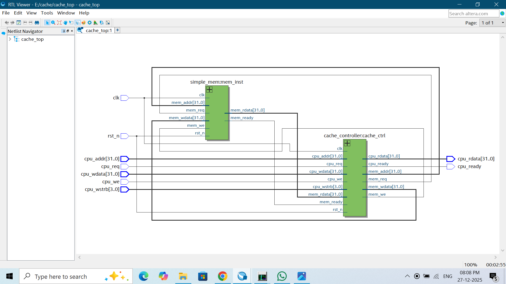
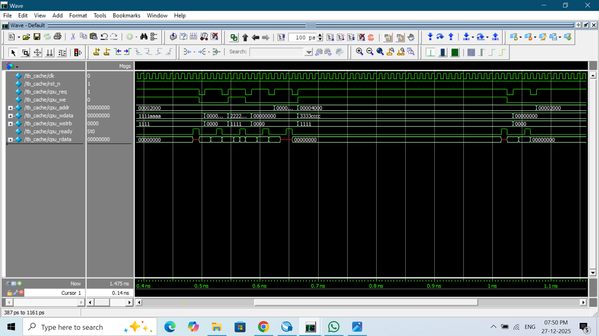

# Verilog Implementation of 16KB 2-Way Set Associative Cache

This repository contains the Verilog implementation of a **16KB, 2-way set associative cache memory system**. The cache is designed for a 32-bit CPU address space with a **64-byte block size**, low-level **write-back** and **write-allocate** mechanisms, **LRU eviction**, and a **Mealy FSM controller**. The project is validated in **ModelSim (Quartus)** and demonstrates fundamental memory hierarchy concepts used in modern processors.

---

## 📑 Table of Contents

1. [Description](#-description)  
2. [Key Concepts Learnt](#-key-concepts-learnt)  
3. [Cache Specifications](#-Cache-specifications)  
4. [Main Memory Specification](#-main-memory-specification)  
5. [Address Breakdown](#-address-breakdown)  
7. [Simulation Outputs](#-simulation-outputs)    
9. [Contact](#-contact)

---

## 📘 Description

A cache acts as a high-speed memory buffer between CPU and main memory. This design implements a **16KB cache** with **2-way associativity**, functioning as a mini memory subsystem that reduces the average memory access time. Each cache line stores **64 bytes**, while metadata (Valid, Dirty, Tag) supports lookup and write-back management.

The controller detects hit/miss conditions, performs refill from memory, and evicts lines based on **LRU**. A dirty line is only written back when chosen as an eviction victim, reducing memory traffic and improving efficiency.

---

## 🧠 Key Concepts Learnt

- Splitting CPU address into **Tag, Index, and Offset**
- **LRU replacement** to select eviction candidates
- **Write-Back & Write-Allocate** architecture
- **Dirty-bit based eviction** only when necessary
- **Burst refill/write-back** of 64-byte blocks
- **Mealy FSM** for cycle-accurate control response
- **Waveform debugging** for hit, miss, eviction events

---

## ⚙️ Cache Specifications

| Parameter | Value |
|-----------|--------|
| Cache Size | **16 KB** |
| Associativity | **2-Way Set Associative** |
| Sets | 128 |
| Lines per Set | 2 |
| Total Cache Lines | 256 |
| Block Size | **64 bytes (16 words × 4 bytes)** |
| Replacement Policy | LRU |
| Write Policy | Write-Back |
| Miss Policy | Write-Allocate |
| Controller | Mealy FSM |

---

## 💾 Main Memory Specification

| Parameter | Value |
|-----------|--------|
| Memory Type | Word-addressable RAM |
| Total Size | **256 KB** |
| Word Size | **32 bits / 4 bytes** |
| Number of Words | 65,536 (**2¹⁶**) |
| Address Bits Required | **18 bits** |
| Relevant CPU Bits Used | `[17:2]` for word index |
| Burst Length | **64 bytes → 16 cycles** on refill / write-back |

### 📌 Key Note
> CPU always provides **32-bit addresses**, but main memory uses only the **lower 18 bits** because its capacity is 256 KB.  
> The cache still works on **full 32-bit addresses** for correctness (Tag comparison).

---

## 🧮 Address Breakdown

```
31               13 12          6 5       0
+-----------------+-------------+----------+
|     TAG (19)    | INDEX (7)   | OFFSET (6)
+-----------------+-------------+----------+
```

| Field  | Purpose | Calculation | Bits |
|--------|----------|--------------:|----:|
| Offset | Selects byte inside 64B block | log₂(64) | **6 bits** |
| Index  | Selects set number | log₂(128) | **7 bits** |
| Tag    | Identifies memory region cached | 32 − (6 + 7) | **19 bits** |

✔️ This is the correct breakdown for **32-bit address + 64B block + 128 sets**.

---

## 📸 Simulation Outputs

## Block Diagram


## RTL View


## State Machine


## Waveform Output


## Transcript Output


## 📬 Contact

**Vasantha Vidhya**  
📧 vasanthavidhyapv@email.com  
🔗 https://www.linkedin.com/in/vasantha-vidhya-3b53aa25a/


> *Building this project strengthened my understanding of hardware memory hierarchy and cycle-accurate caching behavior. Designing the controller, handling address mapping, and observing waveform behavior taught me system-level thinking essential for VLSI design.* 🚀

